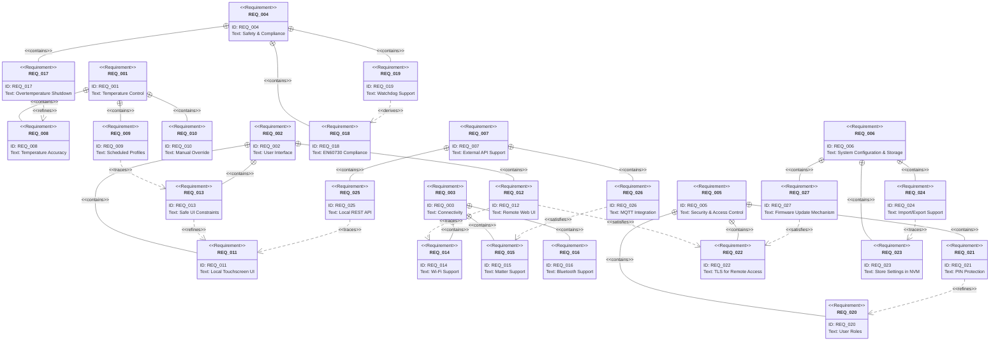

<!-- filepath: docs/reqs.md -->
# Requiremenst

## Reqs Mermaid



## reqs yaml

``` yaml
requirements:
- id: REQ_001
  title: Temperature Control
  description: 'The system **shall** control room temperature based on:\n\n    Accuracy and responsiveness are critical to user comfort.'
  tags:
  - core
  - control
  status:
    implemented: true
    verified: false
  children:
  - id: REQ_008
    title: Temperature Accuracy
  - id: REQ_009
    title: Scheduled Profiles
  - id: REQ_010
    title: Manual Override
- id: REQ_002
  title: User Interface
  description: 'Users shall be able to interact with the system via:\n\n    - A simplified fallback control method'
  tags:
  - ui
  - usability
  children:
  - id: REQ_011
    title: Local Touchscreen UI
    - hmi
  - id: REQ_012
    title: Remote Web UI
  - id: REQ_013
    title: Safe UI Constraints
- id: REQ_003
  title: Connectivity
  description: The device must support **multiple communication paths** for both user access and smart home integration.
  tags:
  - iot
  - integration
  children:
  - id: REQ_014
- id: REQ_004
  title: Safety & Compliance
- id: REQ_005
  title: Security & Access Control
- id: REQ_006
  title: System Configuration & Storage
- id: REQ_007
  title: External API Support

```
